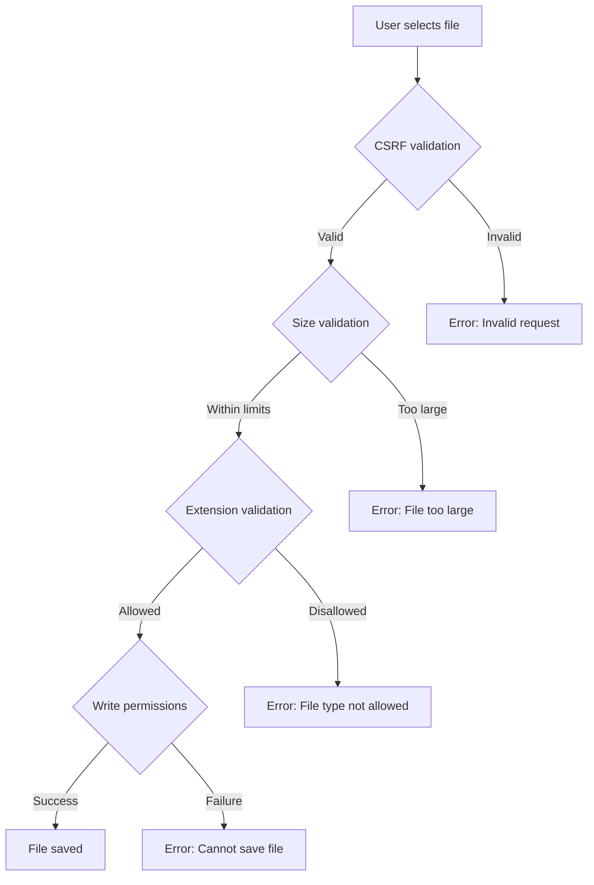
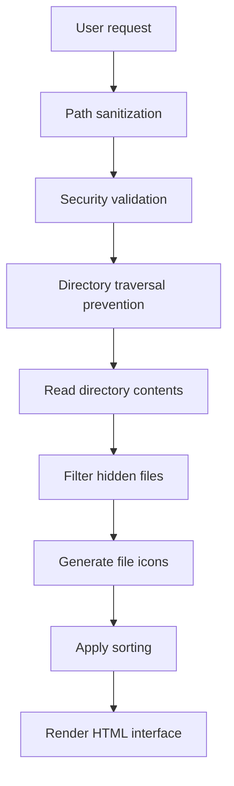

# xsukax Directory Listing System (XDLS)


A secure, modern, and feature-rich directory listing system written in PHP that provides an elegant interface for browsing and managing files on web servers.

## Project Overview

XDLS is a comprehensive directory listing solution designed to replace basic server directory indexes with a fully-featured file management interface. It offers a clean, responsive design with advanced functionality while maintaining strong security protections.

The system provides:
- Intuitive file and directory browsing with breadcrumb navigation
- File previews and downloads with proper MIME type handling
- Advanced sorting and filtering capabilities
- Responsive design that works on desktop and mobile devices
- Theme support (light/dark/auto)
- Comprehensive security measures against common web vulnerabilities

## Security and Privacy Benefits

XDLS incorporates multiple layers of security to protect both the server and users:

### Core Security Features
- **CSRF Protection**: All state-changing operations require valid CSRF tokens
- **Path Sanitization**: Prevents directory traversal attacks
- **Content Security Policy**: Restricts resources to trusted sources only
- **MIME Type Validation**: Ensures files are served with appropriate headers
- **Extension Blocking**: Prevents execution of dangerous file types (PHP, executables, etc.)
- **Symlink Control**: Configurable symlink following to prevent information disclosure
- **Security Headers**: Implements modern security headers (XSS protection, frame options, etc.)

### Privacy Enhancements
- **No Tracking**: The software doesn't include any analytics or tracking mechanisms
- **Local Processing**: All file operations occur client-side when possible
- **Minimal Data Collection**: No personal information is collected or stored
- **Transparent Operations**: All actions are visible and controllable by the user

## Features and Advantages

### Key Features
- 🎨 **Modern UI**: Clean, responsive interface with light/dark theme support
- 🔍 **Advanced Search**: Real-time filtering of files and directories
- 📊 **File Previews**: Visual representations of different file types
- 📁 **Smart Sorting**: Multi-column sorting with visual indicators
- 📱 **Mobile Friendly**: Responsive design that works on all devices
- ⚡ **Performance Optimized**: Efficient code with minimal server load
- 🔒 **Security First**: Comprehensive security measures built-in
- 🖥️ **Easy Deployment**: Single file installation with zero dependencies

### Advantages Over Alternatives
- No database required - operates with just PHP
- Extremely lightweight with minimal resource usage
- Comprehensive security model out of the box
- Customizable through a clean configuration class
- Regular expression-based path sanitization
- Professional UI with accessibility considerations

## Installation Instructions

### Requirements
- PHP 7.4 or higher
- Web server (Apache, Nginx, etc.)
- File system read access (write access optional for uploads)

### Installation Steps
1. Upload the `index.php` file to the directory you want to list
2. Ensure PHP has read permissions for the target directory
3. Access the directory via your web browser

### Optional Configuration
Edit the `Config` class in the PHP file to customize behavior:

```php
final class Config {
    public const SHOW_HIDDEN = 'hidden'; // Query parameter for showing hidden files
    public const FOLLOW_SYMLINKS = false; // Whether to follow symbolic links
    public const ENABLE_DOWNLOADS = true; // Allow file downloads
    public const ENABLE_UPLOADS = false; // Enable file upload functionality
    public const MAX_UPLOAD_SIZE = 10485760; // 10MB max upload size
    // ... more options available
}
```

### Security Hardening
For production environments, consider these additional measures:
- Place the script in a dedicated directory with appropriate permissions
- Restrict access via .htaccess or server configuration
- Regularly update to the latest version
- Monitor server logs for suspicious activity

## Usage Guide

### Basic Navigation
1. Access the directory where you placed index.php through your web browser
2. Use the breadcrumb trail to navigate between folders
3. Click on folders to explore their contents
4. Click on files to download them (if downloads are enabled)

### Advanced Features
- **Search**: Use the search box to filter results in real-time (Ctrl+K shortcut)
- **Sorting**: Click column headers to sort (Shift+click for multi-column sorting)
- **Hidden Files**: Toggle the "Show hidden" switch to display dotfiles
- **Theme Switching**: Use the theme toggle to change between light/dark modes

### File Upload Process


### Directory Browsing Architecture


## Licensing Information

This project is licensed under the GNU General Public License v3.0. This means:

1. You are free to use, modify, and distribute the software
2. You must disclose your source code when distributing the software
3. You must license derivative works under the same license
4. The software comes with no warranty

For the full license text, see [LICENSE](LICENSE) file or visit [https://www.gnu.org/licenses/gpl-3.0.html](https://www.gnu.org/licenses/gpl-3.0.html).

## Contributing

We welcome contributions to improve XDLS. Please ensure that:
- Code follows the existing style and structure
- Security measures are maintained or enhanced
- New features include appropriate tests
- Documentation is updated accordingly

## Support

For issues and questions:
1. Check the configuration options in the Config class
2. Ensure your PHP version meets requirements
3. Verify file and directory permissions
4. Review server error logs for specific issues

## Disclaimer

This software is provided as-is without any warranties. The authors are not responsible for any damages or security issues that may arise from its use. Always test in a secure environment before deploying to production.
